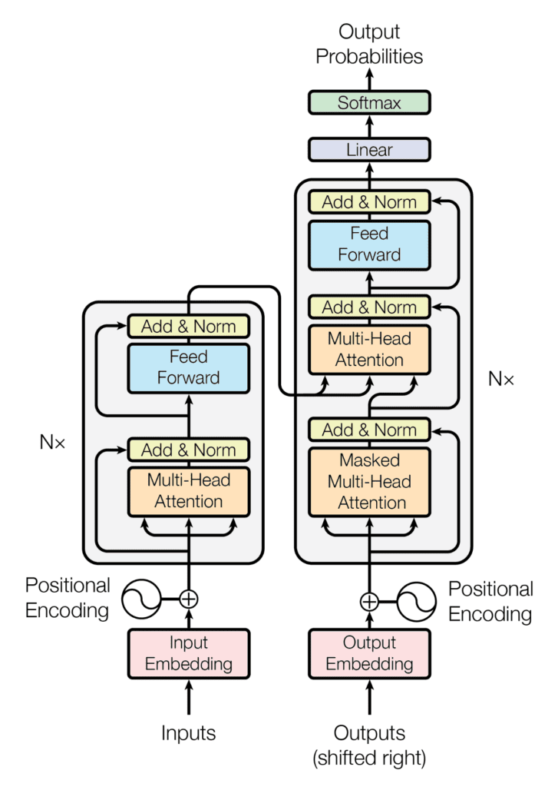

# Transformer Architecture (English + 中文) — Components, Code, and Diagrams

This document explains the **Transformer** architecture section-by-section, with **English + Chinese** explanations and **PyTorch** code in each component.

> **Full runnable implementation:** All code blocks below are extracted and organized in `model.py`, which you can run directly.

## The Transformer Architecture

The Transformer architecture follows an encoder-decoder structure but does not rely on recurrence and convolutions in order to generate an output. 

Transformer 架构遵循编码器—解码器（encoder-decoder）结构，但在生成输出时不依赖循环结构（recurrence）或卷积（convolutions）。

- The  encoder-decoder structure of the Transformer architecture, Taken from “Attention Is All You Need“ 
  

In a nutshell, the task of the encoder, on the left half of the Transformer architecture, is to map an input sequence to a sequence of continuous representations, which is then fed into a decoder. 

简单来说，Transformer 架构左半部分的编码器（encoder）的任务，是将输入序列映射为一串连续的表示（continuous representations），然后把它们输入到解码器（decoder）中。

The decoder, on the right half of the architecture, receives the output of the encoder together with the decoder output at the previous time step to generate an output sequence.

Transformer 架构右半部分的解码器（decoder），会接收编码器的输出，并结合前一个时间步的解码器输出，从而生成输出序列。

The encoder consists of a stack of 𝑁 = 6 identical layers, where each layer is composed of two sublayers:

The first sublayer implements a multi-head self-attention mechanism. You have seen that the multi-head mechanism implements ℎ heads that receive a (different) linearly projected version of the queries, keys, and values, each to produce ℎ outputs in parallel that are then used to generate a final result. 

The second sublayer is a fully connected feed-forward network consisting of two linear transformations with Rectified Linear Unit (ReLU) activation in between:

$FFN⁡(𝑥)=ReLU⁡(𝐖1⁢𝑥+𝑏1)⁢𝐖2+𝑏2$

The six layers of the Transformer encoder apply the same linear transformations to all the words in the input sequence, but each layer employs different weight (𝐖1,𝐖2) and bias (𝑏1,𝑏2) parameters to do so. 

Furthermore, each of these two sublayers has a residual connection around it.

Each sublayer is also succeeded by a normalization layer, layernorm⁡(.), which normalizes the sum computed between the sublayer input, 𝑥, and the output generated by the sublayer itself, sublayer⁡(𝑥):

$layernorm⁡(𝑥+sublayer⁡(𝑥))$

An important consideration to keep in mind is that the Transformer architecture cannot inherently capture any information about the relative positions of the words in the sequence since it does not make use of recurrence. This information has to be injected by introducing positional encodings to the input embeddings. 

The positional encoding vectors are of the same dimension as the input embeddings and are generated using sine and cosine functions of different frequencies. Then, they are simply summed to the input embeddings in order to inject the positional information.


编码器由 𝑁 = 6 个相同层（identical layers）堆叠而成，每一层包含两个子层（sublayers）：

第一个子层实现多头自注意力（multi-head self-attention）机制。多头机制包含 ℎ 个头（heads），每个头接收一组（不同的）对 queries、keys、values 的线性投影（linearly projected），并行地产生 ℎ 个输出，随后这些输出会被组合起来形成最终结果。

第二个子层是一个全连接前馈网络（fully connected feed-forward network），它由两次线性变换组成，中间使用**修正线性单元（ReLU）**激活函数：

$FFN⁡(𝑥)=ReLU⁡(𝐖1⁢𝑥+𝑏1)⁢𝐖2+𝑏2$

Transformer 编码器的 6 层对输入序列中的所有词都应用相同形式的线性变换，但每一层使用不同的权重参数（𝐖1,𝐖2）和偏置参数（𝑏1,𝑏2）。

此外，这两个子层的外面都带有残差连接（residual connection）。

每个子层之后还会接一个归一化层（normalization layer） 。它会对子层 sublayer(x)的输出之和进行归一化：

$layernorm⁡(𝑥+sublayer⁡(𝑥))$

一个重要点是：由于 Transformer 不使用循环结构，它无法天然捕捉序列中词与词之间的相对位置信息。因此必须通过在输入嵌入中引入**位置编码（positional encodings）**来注入位置信息。

位置编码向量与输入嵌入具有相同维度，通常使用不同频率的正弦（sine）与余弦（cosine）函数生成，然后将其与输入嵌入直接相加，从而注入位置信息。


---

## 1) Embedding (Token Embedding)

### English
Transformers do not operate on raw text. They operate on vectors. The first step is to convert discrete token IDs into continuous vectors using an **embedding matrix**:

- Vocabulary size: $V$
- Model dimension: $d_{\text{model}}$
- Embedding table: $E \in \mathbb{R}^{V \times d_{\text{model}}}$
- If your token IDs are $t \in \{0,\ldots,V-1\}$, then $x = E[t]$ gives a vector of length $d_{\text{model}}$.

A key property: embeddings are **learned parameters**. During training, backpropagation updates $E$ so that tokens used in similar contexts tend to get similar vectors (in a task-dependent way).

**Why embeddings?**
- They provide a dense representation where geometry can capture similarity.
- They make the model differentiable end-to-end (IDs → vectors → computations → loss).

### 中文
Transformer 不能直接处理文本（离散符号），而是处理向量。第一步是把 token 的整数 ID 映射成连续向量，这就是 **词嵌入（Token Embedding）**：

- 词表大小：$V$
- 模型维度：$d_{\text{model}}$
- 嵌入矩阵：$E \in \mathbb{R}^{V \times d_{\text{model}}}$
- 对于 token ID $t$，嵌入向量 $x = E[t]$（长度为 $d_{\text{model}}$）

嵌入矩阵 $E$ 是 **可学习参数**，会在训练中通过反向传播不断更新，使得在相似上下文出现的 token（在任务意义上）学习到更相近的向量表示。

**为什么需要嵌入？**
- 稠密向量空间能表达相似性与关系
- 让模型可端到端训练（ID → 向量 → 计算 → 损失）

### PyTorch code
```python
import torch
import torch.nn as nn

V = 50000   # vocabulary size (example)
B, L = 2, 6 # batch size, sequence length

class InputEmbeddings(nn.Module):
    """Maps token IDs (integer indices) to continuous d_model-dimensional vectors."""
    def __init__(self, d_model: int, vocab_size: int, device=None):
        super().__init__()
        self.d_model = d_model
        self.vocab_size = vocab_size
        self.embedding = nn.Embedding(vocab_size, d_model)  # Input must be Long/Int indices

    def forward(self, x):
        # x: (B, L) token ids -> output: (B, L, d_model)
        return self.embedding(x)

# Demo: batch of token IDs
token_ids = torch.randint(0, V, (B, L))
emb = InputEmbeddings(d_model=512, vocab_size=V)
x = emb(token_ids)  # (B, L, d_model)
```

---

## 2) Position Embedding (Positional Encoding / Positional Embedding)

### English
Self-attention is permutation-invariant: if you shuffle tokens, attention alone doesn’t know you shuffled them. So Transformers inject **position information** into token representations.

Two common approaches:

**(A) Sinusoidal positional encoding (fixed, not learned)**
- Deterministic functions of position $\text{pos}$ and dimension index $i$.
- Helps generalize to longer sequences (in some settings) because it extrapolates.

**(B) Learned positional embedding**
- A learnable table $P \in \mathbb{R}^{L_{\max} \times d_{\text{model}}}$.
- Common in many modern LLMs (sometimes replaced by RoPE/ALiBi variants).

The usual implementation:  
$X_0 = \text{TokenEmbedding}(\text{tokens}) + \text{PositionEmbedding}(\text{positions})$  
where $X_0 \in \mathbb{R}^{B \times L \times d_{\text{model}}}$ is the input to the first Transformer block.

### 中文
自注意力本身对顺序不敏感（置换不变）：如果你把 token 顺序打乱，attention 机制本身并不知道顺序改变了。因此 Transformer 必须注入 **位置信息**。

常见两种：

**(A) 正弦位置编码（固定，不学习）**
- position $\text{pos}$ 与维度 $i$ 的确定性函数
- 在某些场景对更长序列外推更友好

**(B) 可学习位置嵌入**
- 直接学习一个表 $P \in \mathbb{R}^{L_{\max} \times d_{\text{model}}}$
- 现代模型也可能使用 RoPE/ALiBi 等更高级变体

通常做法：  
$X_0 = \text{TokenEmbedding}(\text{tokens}) + \text{PositionEmbedding}(\text{positions})$  
得到 $X_0 \in \mathbb{R}^{B \times L \times d_{\text{model}}}$，作为第一层 Transformer 的输入。

### PyTorch code

**A) Sinusoidal positional encoding (module, fixed, not learned):**
```python
import math
import torch
import torch.nn as nn

class PositionalEncoding(nn.Module):
    """Sinusoidal PE: sin for even indices, cos for odd. div_term = 10000^(-2i/d_model)."""
    def __init__(self, d_model: int, seq_len: int, dropout: float, device=None):
        super().__init__()
        self.dropout = nn.Dropout(dropout)
        pe = torch.zeros(seq_len, d_model, device=device or "cpu")
        position = torch.arange(0, seq_len, dtype=torch.float, device=pe.device).unsqueeze(1)
        div_term = torch.exp(torch.arange(0, d_model, 2, device=pe.device).float() * (-math.log(10000.0) / d_model))
        pe[:, 0::2] = torch.sin(position * div_term)
        pe[:, 1::2] = torch.cos(position * div_term)
        self.register_buffer('pe', pe.unsqueeze(0))  # (1, seq_len, d_model)

    def forward(self, x):
        x = x + self.pe[:, :x.size(1), :].requires_grad_(False)
        return self.dropout(x)
```

**B) Learned positional embedding (table):**
```python
# L_max = max sequence length
pos_emb = nn.Embedding(L_max, d_model)
positions = torch.arange(L, device=x.device).unsqueeze(0).expand(B, L)  # (B, L)
x_with_pos = x_tok + pos_emb(positions)  # add learnable position vectors
```

---

## 3) Self-Attention (Scaled Dot-Product Attention + Multi-Head)

### English
Self-attention is the Transformer’s core. For each token, it decides how much to “look at” every other token.

Given input $X \in \mathbb{R}^{B \times L \times d_{\text{model}}}$, project it into:
- $Q = XW_Q$, $K = XW_K$, $V = XW_V$

Then compute attention weights:
- $\text{Scores} = (QK^\top) / \sqrt{d_k}$
- $A = \text{softmax}(\text{Scores} + \text{mask})$
- $\text{Output} = AV$

**Masking matters**
- Encoder self-attention: usually no causal mask (tokens can attend to all positions).
- Decoder self-attention: causal mask (cannot attend to future tokens).

**Multi-head attention**
Instead of one attention, we split the model dimension into $h$ heads:
- Each head attends in a smaller subspace $d_k = d_{\text{model}} / h$.
- Heads are concatenated and projected back.

This gives the model multiple “views” of relationships: syntax-like, semantic-like, positional-like patterns can emerge across heads.

### 中文
自注意力是 Transformer 的核心：每个 token 会决定要从序列中哪些 token “获取信息”。

对输入 $X \in \mathbb{R}^{B \times L \times d_{\text{model}}}$ 做三组线性投影：
- $Q = XW_Q$, $K = XW_K$, $V = XW_V$

注意力计算：
- $\text{Scores} = (QK^\top) / \sqrt{d_k}$
- $A = \text{softmax}(\text{Scores} + \text{mask})$
- $\text{Output} = AV$

**mask 很关键**
- Encoder 自注意力：通常不加因果 mask（可以看全局）
- Decoder 自注意力：加因果 mask（不能看未来 token）

**多头注意力**
把维度拆成 $h$ 个头：
- 每个头在更小子空间 $d_k = d_{\text{model}} / h$ 里做注意力
- 最后拼接并投影回 $d_{\text{model}}$

多头的好处是模型能在不同头里学到不同类型的关系（语法、语义、位置等）。

### PyTorch code

**Causal mask (for decoder):**
```python
def causal_mask(L: int, device=None):
    """(L, L) bool: True = positions to mask. Position i cannot attend to j > i."""
    device = device or "cpu"
    return torch.triu(torch.ones(L, L, device=device, dtype=torch.bool), diagonal=1)
```

**Multi-head self-attention:**
```python
import torch
import torch.nn as nn
import torch.nn.functional as F

class MultiHeadSelfAttention(nn.Module):
    """Q, K, V all from same input. Scaled dot-product: scores = QK^T / sqrt(d_k)."""
    def __init__(self, d_model: int, n_heads: int, dropout: float = 0.0, device=None):
        super().__init__()
        assert d_model % n_heads == 0
        self.d_model = d_model
        self.n_heads = n_heads
        self.d_head = d_model // n_heads
        self.Wq = nn.Linear(d_model, d_model, bias=False)
        self.Wk = nn.Linear(d_model, d_model, bias=False)
        self.Wv = nn.Linear(d_model, d_model, bias=False)
        self.Wo = nn.Linear(d_model, d_model, bias=False)
        self.dropout = nn.Dropout(dropout)

    def forward(self, x, attn_mask=None):
        # x: (B, L, d_model)  attn_mask: (L, L) bool
        B, L, _ = x.shape
        q = self.Wq(x)
        k = self.Wk(x)
        v = self.Wv(x)
        q = q.view(B, L, self.n_heads, self.d_head).transpose(1, 2)
        k = k.view(B, L, self.n_heads, self.d_head).transpose(1, 2)
        v = v.view(B, L, self.n_heads, self.d_head).transpose(1, 2)
        scores = (q @ k.transpose(-2, -1)) / (self.d_head ** 0.5)
        if attn_mask is not None:
            scores = scores.masked_fill(attn_mask.unsqueeze(0).unsqueeze(0), float("-inf"))
        attn = F.softmax(scores, dim=-1)
        attn = self.dropout(attn)
        out = attn @ v
        out = out.transpose(1, 2).contiguous().view(B, L, self.d_model)
        return self.Wo(out)

# Demo: encoder (no mask) vs decoder (causal mask)
B, L, d_model, h = 2, 8, 64, 8
x = torch.randn(B, L, d_model)
mha = MultiHeadSelfAttention(d_model, h)
y_enc = mha(x)
y_dec = mha(x, attn_mask=causal_mask(L, device=x.device))
print(y_enc.shape, y_dec.shape)
```

---

## 4) Encoder (Transformer Encoder Block)

### English
An **encoder** processes the entire input sequence into contextual representations (“memory”) used later by the decoder (in encoder–decoder models) or by a classification head (in encoder-only models like BERT).

A standard encoder layer contains:
1) Multi-head self-attention  
2) Feed-forward network (FFN), applied position-wise  
3) Residual connections + LayerNorm (often “Pre-LN” in modern designs)

FFN typically is:
- $\text{FFN}(x) = W_2 \cdot \text{GELU}(W_1 \cdot x)$

**Pre-LN vs Post-LN**
- Original Transformer used Post-LN (LayerNorm after residual).
- Many modern LLMs use Pre-LN (LayerNorm before sublayer) for stability.

### 中文
**Encoder** 会把整段输入序列编码成上下文化表示（常称为 memory）。在 encoder–decoder 架构里，decoder 的 cross-attention 会读取这份 memory；在 encoder-only 模型里，这些表示会接分类头或其他任务头。

典型 Encoder Layer 包含：
1) 多头自注意力  
2) 前馈网络 FFN（逐位置独立）  
3) 残差连接 + LayerNorm（现代常用 Pre-LN）

FFN 常见形式：
- $\text{FFN}(x) = W_2 \cdot \text{GELU}(W_1 \cdot x)$

**Pre-LN vs Post-LN**
- 原论文是 Post-LN
- 很多现代大模型用 Pre-LN 提升训练稳定性

### PyTorch code

*Requires: `MultiHeadSelfAttention` from §3.*

**Feed-forward network (position-wise, GELU):**
```python
class FeedForward(nn.Module):
    """FFN(x) = W2 * GELU(W1 * x). Expands to d_ff then back to d_model."""
    def __init__(self, d_model: int, d_ff: int, dropout: float = 0.0):
        super().__init__()
        self.fc1 = nn.Linear(d_model, d_ff)
        self.fc2 = nn.Linear(d_ff, d_model)
        self.dropout = nn.Dropout(dropout)

    def forward(self, x):
        x = self.fc1(x)
        x = F.gelu(x)
        x = self.dropout(x)
        return self.fc2(x)
```

**Encoder layer and full encoder:**
```python
class EncoderLayer(nn.Module):
    """Pre-norm: self-attention + FFN, each with residual."""
    def __init__(self, d_model: int, n_heads: int, d_ff: int, dropout: float = 0.1):
        super().__init__()
        self.ln1 = nn.LayerNorm(d_model)
        self.attn = MultiHeadSelfAttention(d_model, n_heads, dropout=dropout)
        self.ln2 = nn.LayerNorm(d_model)
        self.ffn = FeedForward(d_model, d_ff, dropout=dropout)
        self.dropout = nn.Dropout(dropout)

    def forward(self, x, attn_mask=None):
        x = x + self.dropout(self.attn(self.ln1(x), attn_mask=attn_mask))
        x = x + self.dropout(self.ffn(self.ln2(x)))
        return x

class Encoder(nn.Module):
    """Stack of encoder layers. Expects pre-embedded input (B, L, d_model)."""
    def __init__(self, n_layers: int, d_model: int, n_heads: int, d_ff: int, dropout: float = 0.1):
        super().__init__()
        self.layers = nn.ModuleList([EncoderLayer(d_model, n_heads, d_ff, dropout) for _ in range(n_layers)])
        self.ln_final = nn.LayerNorm(d_model)

    def forward(self, x, attn_mask=None):
        for layer in self.layers:
            x = layer(x, attn_mask=attn_mask)
        return self.ln_final(x)

# Demo
B, L, d_model = 2, 10, 64
x0 = torch.randn(B, L, d_model)  # already embedded
enc = Encoder(n_layers=4, d_model=d_model, n_heads=8, d_ff=256)
memory = enc(x0)
print(memory.shape)  # (B, L, d_model)
```

---

## 5) Decoder (Transformer Decoder Block)

### English
The **decoder** generates output tokens autoregressively. Each decoder layer typically has:

1) **Masked** self-attention (causal) over already-generated tokens  
2) **Cross-attention**: queries from decoder attend to keys/values from encoder memory  
3) FFN  
4) Residual + LayerNorm (often Pre-LN)

Cross-attention lets the decoder “look up” relevant parts of the source sequence while generating each token.

### 中文
**Decoder** 用自回归方式生成输出：一次生成一个 token。每个 decoder layer 通常包含：

1) **Masked** 自注意力（因果 mask，只能看已生成部分）  
2) **Cross-attention**：decoder 的 Q 去关注 encoder memory 的 K/V  
3) FFN  
4) 残差 + LayerNorm（常用 Pre-LN）

Cross-attention 的作用是：在生成每个 token 时，decoder 能根据需要从输入序列中检索信息。

### PyTorch code

*Requires: `MultiHeadSelfAttention` (§3), `FeedForward` (§4), `PositionalEncoding` (§2), `InputEmbeddings` (§1).*

**General multi-head attention (Q from x_q, K/V from x_kv):**
```python
class MultiHeadAttention(nn.Module):
    """Used for self-attention (x_q=x_kv) and cross-attention (x_q=decoder, x_kv=memory)."""
    def __init__(self, d_model: int, n_heads: int, dropout: float = 0.0):
        super().__init__()
        assert d_model % n_heads == 0
        self.d_model = d_model
        self.n_heads = n_heads
        self.d_head = d_model // n_heads
        self.Wq = nn.Linear(d_model, d_model, bias=False)
        self.Wk = nn.Linear(d_model, d_model, bias=False)
        self.Wv = nn.Linear(d_model, d_model, bias=False)
        self.Wo = nn.Linear(d_model, d_model, bias=False)
        self.dropout = nn.Dropout(dropout)

    def forward(self, x_q, x_kv, attn_mask=None):
        B, Lq, _ = x_q.shape
        _, Lk, _ = x_kv.shape
        q = self.Wq(x_q).view(B, Lq, self.n_heads, self.d_head).transpose(1, 2)
        k = self.Wk(x_kv).view(B, Lk, self.n_heads, self.d_head).transpose(1, 2)
        v = self.Wv(x_kv).view(B, Lk, self.n_heads, self.d_head).transpose(1, 2)
        scores = (q @ k.transpose(-2, -1)) / (self.d_head ** 0.5)
        if attn_mask is not None:
            scores = scores.masked_fill(attn_mask.unsqueeze(0).unsqueeze(0), float("-inf"))
        attn = F.softmax(scores, dim=-1)
        attn = self.dropout(attn)
        out = attn @ v
        out = out.transpose(1, 2).contiguous().view(B, Lq, self.d_model)
        return self.Wo(out)
```

**Decoder layer and full decoder:**
```python
class DecoderLayer(nn.Module):
    """Masked self-attention + cross-attention (to memory) + FFN. All Pre-LN + residual."""
    def __init__(self, d_model: int, n_heads: int, d_ff: int, dropout: float = 0.1):
        super().__init__()
        self.ln1 = nn.LayerNorm(d_model)
        self.self_attn = MultiHeadAttention(d_model, n_heads, dropout)
        self.ln2 = nn.LayerNorm(d_model)
        self.cross_attn = MultiHeadAttention(d_model, n_heads, dropout)
        self.ln3 = nn.LayerNorm(d_model)
        self.ffn = FeedForward(d_model, d_ff, dropout)
        self.dropout = nn.Dropout(dropout)

    def forward(self, x, memory, self_mask=None, cross_mask=None):
        x = x + self.dropout(self.self_attn(self.ln1(x), self.ln1(x), attn_mask=self_mask))
        x = x + self.dropout(self.cross_attn(self.ln2(x), memory, attn_mask=cross_mask))
        x = x + self.dropout(self.ffn(self.ln3(x)))
        return x

class Decoder(nn.Module):
    """Embed + add sinusoidal PE, then stack of decoder layers. Input: (B, Lt) token IDs."""
    def __init__(self, n_layers: int, d_model: int, n_heads: int, d_ff: int, vocab_size: int, max_seq_len: int, dropout: float = 0.1):
        super().__init__()
        self.embedding = InputEmbeddings(d_model, vocab_size)
        self.positional_encoding = PositionalEncoding(d_model, max_seq_len, dropout)
        self.layers = nn.ModuleList([DecoderLayer(d_model, n_heads, d_ff, dropout) for _ in range(n_layers)])
        self.ln_final = nn.LayerNorm(d_model)

    def forward(self, x, memory, self_mask=None, cross_mask=None):
        x = self.embedding(x)
        x = self.positional_encoding(x)
        for layer in self.layers:
            x = layer(x, memory, self_mask=self_mask, cross_mask=cross_mask)
        return self.ln_final(x)
```

---

## 6) Training & Inference (Teacher Forcing vs Autoregressive Generation)

### English
**Training (teacher forcing)**  
We feed the decoder the ground-truth target tokens shifted right:

- Input to decoder: $\text{tgt\_in} = [\langle\text{bos}\rangle, y_1, y_2, \ldots, y_{T-1}]$

- Model predicts: $\hat{y} = [y_1, y_2, \ldots, y_T]$

- Loss: cross-entropy over next-token predictions.

Because the entire target sequence is known during training, we can compute outputs for all positions in one forward pass (with causal masking).

**Inference (generation)**  
At test time, we don’t have ground-truth future tokens. We must generate:

1) Start with `<bos>`
2) Predict next token
3) Append it to the input
4) Repeat until `<eos>` or max length

To make inference fast, real systems use **KV caching** (store previous attention keys/values) so each step doesn’t recompute everything.

### 中文
**训练（Teacher Forcing）**  
训练时，我们把真实目标序列右移后输入 decoder：

- decoder 输入：$\text{tgt\_in} = [\langle\text{bos}\rangle, y_1, y_2, \ldots, y_{T-1}]$
- 模型预测：$\hat{y} = [y_1, y_2, \ldots, y_T]$
- 损失：对每个位置做 next-token 的交叉熵

训练时目标序列已知，因此可以一次 forward 计算全部位置（配合因果 mask）。

**推理（生成）**  
推理时没有真实未来 token，只能自回归生成：

1) 从 `<bos>` 开始  
2) 预测下一个 token  
3) 拼到输入末尾  
4) 循环直到 `<eos>` 或达到最大长度

为了加速，工程上会使用 **KV cache**，避免每步重复计算历史部分的 K/V。

### PyTorch code

*Requires: all components from §1–5. Full runnable code: `model.py`.*

**1) Seq2Seq model:**
```python
class TransformerSeq2Seq(nn.Module):
    """Source: embed + learnable pos -> Encoder. Target: Decoder (owns embed+PE) -> lm_head."""
    def __init__(self, V_src, V_tgt, d_model=256, n_heads=8, d_ff=1024, n_layers=4, L_max=512, dropout=0.1):
        super().__init__()
        self.src_tok = nn.Embedding(V_src, d_model)
        self.pos_emb = nn.Embedding(L_max, d_model)
        self.encoder = Encoder(n_layers, d_model, n_heads, d_ff, dropout)
        self.decoder = Decoder(n_layers, d_model, n_heads, d_ff, vocab_size=V_tgt, max_seq_len=L_max, dropout=dropout)
        self.lm_head = nn.Linear(d_model, V_tgt, bias=False)

    def add_pos(self, x):
        B, L, _ = x.shape
        pos = torch.arange(L, device=x.device).unsqueeze(0).expand(B, L)
        return x + self.pos_emb(pos)

    def forward(self, src_ids, tgt_in_ids):
        src = self.add_pos(self.src_tok(src_ids))
        memory = self.encoder(src)
        self_mask = causal_mask(tgt_in_ids.size(1), device=src_ids.device)
        dec_out = self.decoder(tgt_in_ids, memory, self_mask=self_mask)  # pass token IDs
        return self.lm_head(dec_out)
```

**2) Greedy decoding:**
```python
@torch.no_grad()
def greedy_decode(model, src_ids, bos_id, eos_id, max_len=64):
    model.eval()
    device = src_ids.device
    generated = torch.full((src_ids.size(0), 1), bos_id, dtype=torch.long, device=device)
    for _ in range(max_len - 1):
        logits = model(src_ids, generated)
        next_id = torch.argmax(logits[:, -1, :], dim=-1, keepdim=True)
        generated = torch.cat([generated, next_id], dim=1)
        if torch.all(next_id.squeeze(1) == eos_id):
            break
    return generated
```

**3) Training step (teacher forcing):**
```python
def training_step(model, optimizer, src_ids, tgt_ids, pad_id):
    model.train()
    tgt_in = tgt_ids[:, :-1]
    tgt_out = tgt_ids[:, 1:]
    logits = model(src_ids, tgt_in)
    loss = F.cross_entropy(logits.reshape(-1, logits.size(-1)), tgt_out.reshape(-1), ignore_index=pad_id)
    optimizer.zero_grad(set_to_none=True)
    loss.backward()
    optimizer.step()
    return loss.item()
```

**4) Demo (GPU if available):**
```python
device = torch.device("cuda" if torch.cuda.is_available() else "cpu")
V_src, V_tgt = 10000, 12000
pad_id, bos_id, eos_id = 0, 1, 2

model = TransformerSeq2Seq(V_src, V_tgt, d_model=128, n_heads=8, d_ff=512, n_layers=2).to(device)
opt = torch.optim.AdamW(model.parameters(), lr=3e-4)

B, Ls, Lt = 2, 12, 10
src = torch.randint(0, V_src, (B, Ls), device=device)
tgt = torch.randint(3, V_tgt, (B, Lt), device=device)
tgt[:, 0], tgt[:, -1] = bos_id, eos_id

loss = training_step(model, opt, src, tgt, pad_id=pad_id)
gen = greedy_decode(model, src, bos_id=bos_id, eos_id=eos_id, max_len=16)
print("loss:", loss, "generated:", gen)
```

---

## 7) RoPE Positional Embedding (Rotary Position Embedding)

### English
**RoPE** (Rotary Position Embedding) injects position information by **rotating** the **query (Q)** and **key (K)** vectors so that their dot product depends on **relative positions**.

**Where it is applied**
- Typically: apply RoPE to $Q$ and $K$ **after linear projection** and **before** computing $QK^\top$.

### 中文
**RoPE（旋转位置编码）** 通过对 **Q/K** 做位置相关的 **旋转**，让点积 $Q \cdot K$ 天然携带 **相对位置信息**。

**应用位置**
- 一般在：线性投影得到 $Q/K$ 后、计算 $QK^\top$ 之前对 $Q/K$ 应用 RoPE。

### PyTorch code (RoPE utilities + applying to Q/K)
```python
import torch
import math

def rope_frequencies(d_head: int, base: float = 10000.0, device=None, dtype=None):
    # Returns inv_freq of shape (d_head/2)
    assert d_head % 2 == 0
    device = device or "cpu"
    dtype = dtype or torch.float32
    i = torch.arange(0, d_head, 2, device=device, dtype=dtype)  # 0,2,4,...
    inv_freq = 1.0 / (base ** (i / d_head))
    return inv_freq

def rope_cos_sin(L: int, inv_freq, device=None, dtype=None):
    # Build cos/sin tables for positions 0..L-1: (L, d_head/2)
    device = device or inv_freq.device
    dtype = dtype or inv_freq.dtype
    pos = torch.arange(L, device=device, dtype=dtype)
    angles = pos[:, None] * inv_freq[None, :]
    return torch.cos(angles), torch.sin(angles)

def apply_rope(x, cos, sin):
    # x: (B, h, L, d_head), cos/sin: (L, d_head/2)
    B, h, L, d = x.shape
    assert d % 2 == 0

    x_even = x[..., 0::2]
    x_odd  = x[..., 1::2]

    cos = cos[None, None, :, :]
    sin = sin[None, None, :, :]

    x_rot_even = x_even * cos - x_odd * sin
    x_rot_odd  = x_even * sin + x_odd * cos

    x_out = torch.empty_like(x)
    x_out[..., 0::2] = x_rot_even
    x_out[..., 1::2] = x_rot_odd
    return x_out

# Example usage
B, h, L, d_head = 2, 8, 16, 64
q = torch.randn(B, h, L, d_head)
k = torch.randn(B, h, L, d_head)

inv_freq = rope_frequencies(d_head, device=q.device, dtype=q.dtype)
cos, sin = rope_cos_sin(L, inv_freq)

q = apply_rope(q, cos, sin)
k = apply_rope(k, cos, sin)

scores = (q @ k.transpose(-2, -1)) / math.sqrt(d_head)
```

**How to plug RoPE into MultiHeadSelfAttention**
After reshaping to `(B,h,L,d_head)` and before computing scores:
```python
inv_freq = rope_frequencies(self.d_head, device=x.device, dtype=x.dtype)
cos, sin = rope_cos_sin(L, inv_freq)
q = apply_rope(q, cos, sin)
k = apply_rope(k, cos, sin)
```

---

## 8) Why Self-Attention is $O(L^2)$

### English
Let $L$ be the sequence length.

### Where the $L^2$ comes from
Scaled dot-product attention builds a score matrix:
- $\text{Scores} = QK^\top$ with shape $(B, h, L, L)$

Each of the $L$ queries compares against all $L$ keys → $L \times L$ interactions, so compute scales as $O(L^2 \cdot d_{\text{head}})$ and is commonly summarized as $O(L^2)$ in terms of length scaling.

### Memory cost is also $O(L^2)$
The attention weights $A$ also have shape $(B, h, L, L)$ and must often be stored (plus additional tensors for backprop), so memory scales quadratically too.

### 中文
设序列长度为 $L$。

### $L^2$ 从哪里来
注意力需要计算分数矩阵：
- $\text{Scores} = QK^\top$，形状为 $(B, h, L, L)$

每个 query（$L$ 个）都要与全部 key（$L$ 个）交互 → $L \times L$ 次，因此计算复杂度为 $O(L^2 \cdot d_{\text{head}})$，常写作长度维度的 $O(L^2)$。

### 内存同样是 $O(L^2)$
注意力权重矩阵同样是 $(B, h, L, L)$，训练时保存激活与梯度会让内存压力更大。

### PyTorch code: demonstrating the $L \times L$ tensor
```python
import torch
import math

B, h, L, d_head = 2, 8, 4096, 64
q = torch.randn(B, h, L, d_head)
k = torch.randn(B, h, L, d_head)

scores = (q @ k.transpose(-2, -1)) / math.sqrt(d_head)
print(scores.shape)

bytes_used = scores.numel() * scores.element_size()
print("scores size (GB):", bytes_used / (1024**3))
```

---

## Appendix: Notes on extending this document

- RoPE is often paired with **KV cache** in inference for speed.
- Long-context efficiency often relies on **FlashAttention** or sparse/linear attention variants.


---

## References / 参考文献

1. Vaswani, A. et al. **Attention Is All You Need**. arXiv:1706.03762. https://arxiv.org/abs/1706.03762  
2. Su, J. et al. **RoFormer: Enhanced Transformer with Rotary Position Embedding**. arXiv:2104.09864. https://arxiv.org/abs/2104.09864  
3. Dao, T. et al. **FlashAttention: Fast and Memory-Efficient Exact Attention with IO-Awareness**. arXiv:2205.14135. https://arxiv.org/abs/2205.14135  
4. Devlin, J. et al. **BERT: Pre-training of Deep Bidirectional Transformers for Language Understanding**. arXiv:1810.04805. https://arxiv.org/abs/1810.04805  
